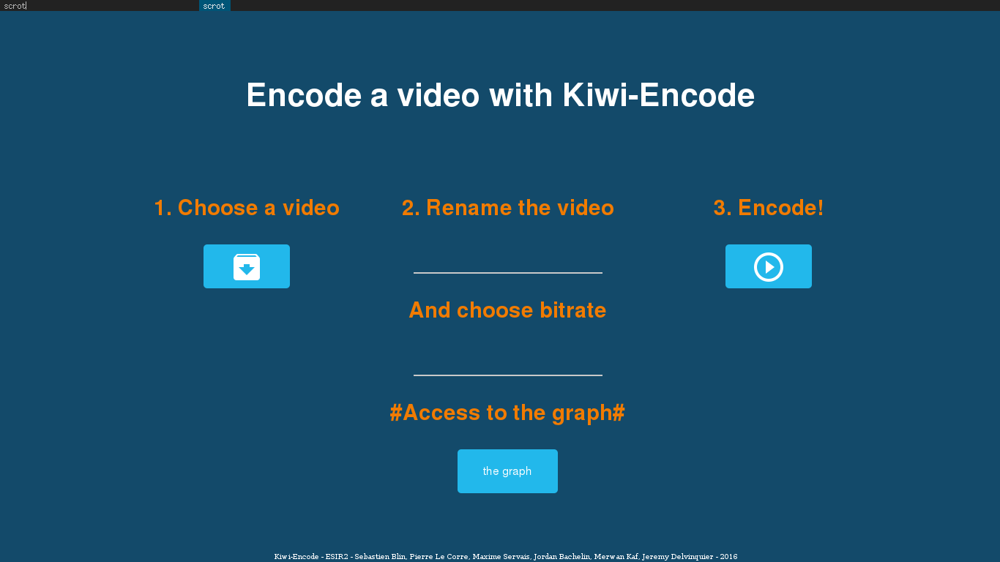

# Docker-VideoEncoding

# Description du projet

Ce projet, réalisé lors du module proejt d'ESIR 2 a pour but de réaliser un scheduling temporel de containers docker fonctionnant sur un cluster de RaspberryPi dans le but de réaliser l'encodage de vidéos.

# Architecture du projet

Ce répertoire contient :

- **Docker_Files** : Les différents docker utilisé pour faire tourner le projet. C'est-à-dire les docker pour _glusterfs_ (utilisé pour avoir un espace commun), _swarm_ (utilisé pour le scheduling temporel des containers), _FileUploader_ qui est l'interface utilisateur, _split/encode/merge_ (utilisés pour encoder une vidéo).
- **FileUploader** : Le code source destiné au fonctionnement de l'interface (où on upload et lance l'encodage d'une vidéo)
- **Script** : Les scripts pour encoder une vidéo.
- **swarm** : Notre version de _DockerSwarm_ pour gérer le scheduling temporel.
- **the-graph** : L'[interface](https://github.com/the-grid/the-graph) utilisé pour voir l'état des dockers.

Pour résumer, ce projet est composé d'un cluster de raspberry pi qui font tourner une instance de glusterfs afin d'avoir un espace de fichier partagé. Un des raspberrys (node1) fait tourner une interface web dans lequel l'utilisateur peut envoyer un fichier a encoder. Ce docker lance un processus (split/encode/merge) où les containers sont gérés par DockerSwarm. Enfin, the-graph sert à la visualisation des états des containers.

# Monter sa propre instance

## Préparation d'un RaspberryPi

## FileUploader

## Utilisation

Sur le node 1, il suffit de faire tourner le docker fileuploader avec la commande suivante : `docker run -it -p 3000:3000 --volume-driver=glusterfs --volume uploads:/uploads --name fileuploader fileuploader`

Ce qui donnera pour interface : 

Les fichers seront uploadés dans le dossier uploads du glusterfs.

## Fonctionnement interne

Le serveur est développé avec nodejs (le code source se trouve dans _/FileUploader_). Lors de l'envoie d'un fichier, 2 fichiers sont ajoutés sur le serveur. Un fichier de la forme toEncode_$DATE$ qui est le fichier uploadé et un .json contenant :

```json
{
  "toEncode":"toEncode_1464009095314",
  "original_name":"$ORIGINALNAME$",
  "wanted_name":"$WANTEDNAME$",
  "bitrate":"$BITRATE$"
}
```

## L'encodage d'une vidéo

Pour comprendre comment ont été installé l'ensemble des packages nécessaires pour cette partie, veuillez vous référer au Dockerfile correspondant à chaque partie (Split, Encode, Merge).

### Split

Ce script permet de couper notre vidéo d'origine en un nombre de parties donné en paramètre de notre script.

Les deux paramètres de ce script sont :

- Le nom du json correspondant à notre vidéo (sans l'extension .json)
- Le nombre de split que l'on souhaite obtenir

Fonctionnement : 

Dans un premier temps on récupère les informations qui nous intéresse dans le .json de notre vidéo (la valeur de toEndode pour obtenir le nom du fichier d'origine à split qui sera donc rentré en paramètre de notre script et la valeur de wanted\_name pour connaître le nom qu'aura chacun de nos splits, si cette valeur est absente on prend alors l'original\_name par défaut).

```
inputFile="$directory"$(grep -Po '(?<="toEncode":")[^"]*' "$directory""$1.json")
outputFile="$directory"$(grep -Po '(?<="wanted_name":")[^"]*' "$directory""$1.json")
outputFileName=$(echo $outputFile | cut -f1 -d '.')

```

Ensuite, on récupère des informations sur la vidéo tel que sa durée mais également toutes ses key\_frames que l'on stocke dans un fichier texte ("$inputFile"\_key\_frame.txt).
Pour effectuer cela, on a utilisé la commande avprobe (installée sur les raspberry et provenant du package libav-tools).

```
avprobe -show_format_entry duration -v quiet "$inputFile"

avprobe  -v quiet -show_packets -of json "$inputFile" | awk '$0 ~ /"pts_time" : "([0-9]|\.)*"/ {toPrint=$3} $0 ~ /"flags" : "K"/ {print toPrint} ' 
| grep -oE \([0-9]\|\\\.\)*  > "$inputFile"_key_frame.txt

```

Une fois toutes ces informations obtenues, on peut alors procéder au découpage de notre vidéo. Pour cela cette fois, nous avons utilisé la commande avconv. Enfin si l'utilisateur entre en second paramètre un nombre souhaité de split supérieur au nombre total de key\_frames de notre vidéo, alors cette dernière sera découpé en cette deuxième valeur (#key\_frames).

```
avconv -y -i "$inputFile" -ss $startTime -t "$splitTime" -codec copy "$outputFileName"_part_"$fileCurrentNumber".mp4

```

Retour : 

- Un fichier .part qui répertorie tous les noms des différents splits de la vidéo (qui sera utilisé ensuite dans le script de merge)
- Notre vidéo découpé en n parties voulues ou au maximum de parties possibles (#key\_frames)

### Encode

Ce script permet d'encoder nos splits de vidéo obtenus grâce au script précédent (scriptSplit).

Les deux paramètres de ce script sont :

- Le nom du json correspondant à notre vidéo (sans l'extension .json)
- Le numéro du split que l'on souhaite encoder

Fonctionnement : 

Nous récupérons la valeur du bitrate sur le fichier json passé en paramètre. Si cette information n'est pas disponible, on donne comme valeur de bitrate celle de la vidéo d'origine obtenue via la commande avprobe. 
Avec cette valeur nous pouvons ensuite lancé notre commande d'encodage via cette fois la commande gst-launch-1.0 (package gstreamer1.0) où le bitrate est justement placé en otion de cette commande. Pour l'encodage, on se sert de omxh264enc qui est l'encodeur hardware présent dans nos raspberrys.

```
gst-launch-1.0 -v filesrc location="$outputFileName"_part_"$2" ! decodebin ! videoconvert ! \
	videoscale ! omxh264enc control-rate=1 \
	target-bitrate="$bitRate" ! h264parse ! mp4mux ! \
	filesink location="$outputFileName"_part_"$2"_encoded.mp4
```

Retour : 

- Notre split de vidéo choisi encodé

### Merge

Ce script permet de faire fusionner nos splits de vidéo obtenus grâce au script scriptSplit et après l'encodage de ces derniers (scriptEncode).

L'unique paramètre de ce script est :

- Le nom du json correspondant à notre vidéo (sans l'extension .json)

Fonctionnement : 

On récupère premièrement dans ce fichier JSON le nom qu'aura notre vidéo finale (wanted\_name ou si absent original\_name).

```
outputFile=$(grep -Po '(?<="wanted_name":")[^"]*' "$1.json")
```

Ensuite, nous procédons au merge via la commande ffmpeg (ici nous n'avons pas réussi à réutiliser avconv pour le merge, cela ne fonctionnait pas...). On met en paramètre de cette commande le fichier .part obtenu après le split de notre vidéo.

```
ffmpeg -y -f concat -i $1.part -c copy "$outputFile"
```

Retour : 

- La vidéo complète et encodée


## DockerSwarm

Cette partie du projet sert à réaliser le scheduling temporel des containers.

### Utilisation

Pour lancer un container sur le swarm : `docker -H tcp://$IPADD:2375 run -d -P --name NAME IMAGE`

Il est possible de faire en sorte qu'un container attende qu'un autre soit finit avec `-e waitfor:container==NAME`. Ainsi par exemple `docker -H tcp://$IPADD:2375 run -d -P -e waitfor:container==h1 --name h2 armhf/hello-world` va créer un container h2 qui attendra que le container h1 soit arrêté.

### Fonctionnement interne

Le code source est disponible dans le module du dossier _/swarm_, principalement dans le dossier _swarm/cluster/state/_. Lors de l'appel à la méthode run, swarm vérifie si toutes les dépendances sont terminées, sinon le container est rajouté à une liste de containers bloqués. À chaque fois qu'un container termine, les dépendances sont vérifiées. Si on peut lancer un container bloqué car toutes les dépendances sont résolues, on le fait.

## The-Graph

### Installation of the graph 

Get dependencies using [Bower](http://bower.io/) and Browserify (via npm and grunt):

```
bower install
npm install
grunt build
```

### But du graph

La librairie open-source the-graph est basé sur noflograph.
Dans notre projet cette librairie nous permet d'afficher les images docker qui sont installés sur les différents Raspberry Pi. 
Il y a 3 types d'images affichés :
1 image split -> Cette image relié sur ses sorties aux différentes images encode.
n images encode -> Ces images sont reliés à l'image split sur leur entrée et à l'image merge sur leur sorties.
1 image merge -> Cette image est relié sur son entrée aux différentes images encode. 

### Fonctionnement interne

The-graph fonctionne grâce à des objets JSON. En effet il faut produire les fichiers JSON qui permettent de décrire tous les noeuds et toutes les connections entre les différents noeuds. Il faut au préalable avoir défini ces noeuds en tant que "components" pour que cela fonctionne.

Pour ce faire, 2 fichiers ont été modifiés pour correspondre à notre projet : 


read-status.js -> Les fonctions nécessaires au bon fonctionnement de notre graph sont définis ici. Une fonction permet de récupérer le json envoyé par la requête GET au swarm. Une fonction permettant de générer la librairie de components et une fonction permettant d'afficher les nodes ainsi que les connections entre les nodes.

index.html -> Permet d'appeler les fonctions définis dans read-status afin de charger le graphe.

# Fonctionnalités

## Fonctionnalités existantes

- Upload de fichiers sur le glusterfs
- Choix du bitrate depuis l'interface web
- Split/Merge d'une vidéo
- waitfor pour le swarm

## TODOList

- Relier au swarm custom du projet.
- Encoder une vidéo

# Licence

```
DO WHAT THE FUCK YOU WANT TO PUBLIC LICENSE
            Version 2, December 2004

Copyright (C) 2004 Sam Hocevar <sam@hocevar.net>

Everyone is permitted to copy and distribute verbatim or modified
copies of this license document, and changing it is allowed as long
as the name is changed.

    DO WHAT THE FUCK YOU WANT TO PUBLIC LICENSE
TERMS AND CONDITIONS FOR COPYING, DISTRIBUTION AND MODIFICATION

0\. You just DO WHAT THE FUCK YOU WANT TO.
```

--------------------------------------------------------------------------------


# TODO

`docker run -it -p 3000:3000 --volume-driver=glusterfs --volume uploads:/uploads --name fileuploader fileuploader`

`docker run -it --volume-driver=glusterfs --volume uploads:/uploads --name split split /bin/bash ScriptSplit.sh $FILENAME$ $NB$`

`docker run --rm -it --volume-driver=glusterfs --volume uploads:/uploads --name merge merge /bin/bash ScriptMerge.sh $FILENAME$`

- share /script/mkWorkflow & /uploads
